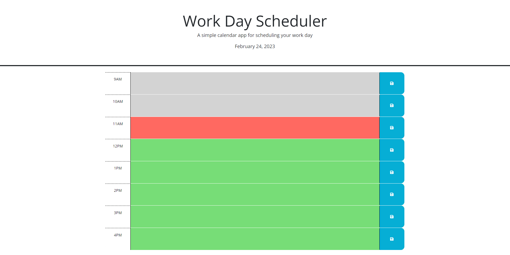

# 05 Third-Party APIs: Work Day Scheduler

## Description

-This project is a simple calendar application for scheduling and storing events/tasks during working hours.

-Using the day.js funcationality, today's date is displayed at the top of the screen.

-Using the day.js 24-hour formatting for the current time, color-coded classes are applied to each of the hourly time-slots. Gray hours have past, red denotes the current hour block, and green denotes all future time-slots.

-Users can enter specific events or tasks in a given time-slot, and upon click of the save button, the text is saved locally, and rendered to the timeslots so that it will remain after page reload. 

-Users can update/delete events and save their changes locally.

## Usage

https://anuffisenough.github.io/Third_Party_API_Challenge/

### Screenshot

### Credits

![MDN Web Docs] https://developer.mozilla.org/en-US/docs/